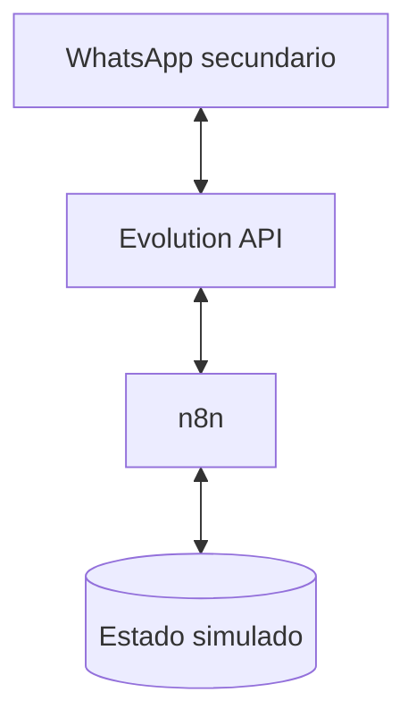
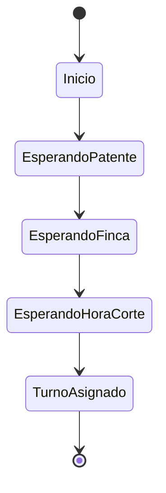
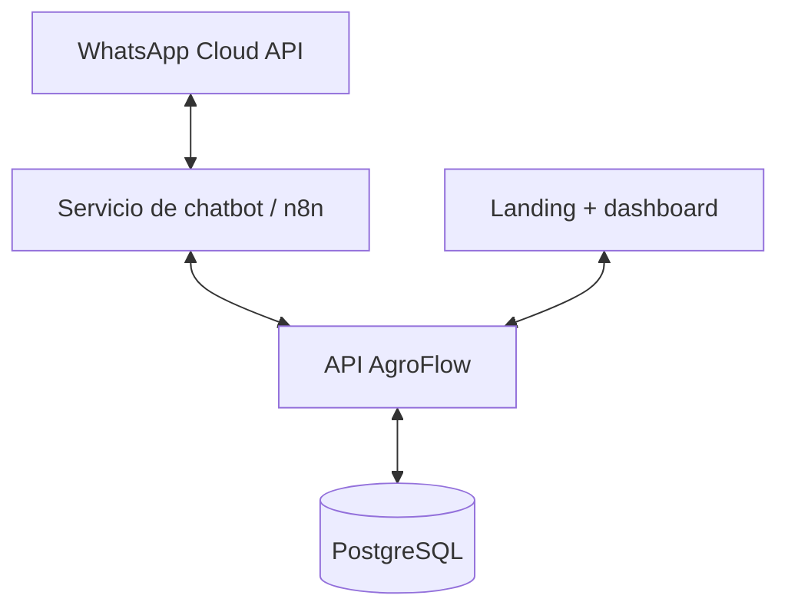

# AgroFlow - Contexto para demo con n8n y arquitectura futura

> Documento de continuidad para trabajar con OpenCode/ChatGPT sobre el VPS.
> Leer completo antes de realizar cambios. La prioridad inmediata es una demostración simple, reversible y aislada del resto de los proyectos del servidor.

## 1. Resumen ejecutivo

AgroFlow es una propuesta de software para optimizar la logística de recepción de caña de azúcar en ingenios del NOA. Busca reducir la acumulación y el tiempo de espera de camiones, coordinar ventanas de llegada y priorizar cargas según reglas del sector, como la antigüedad de la caña cortada y la pertenencia a flota propia o de terceros.

El producto plantea dos interfaces principales:

- Un dashboard web para operarios y administradores del ingenio.
- Un chatbot de WhatsApp para que los transportistas gestionen turnos sin instalar una aplicación.

Para la presentación actual no se necesita construir todavía el sistema completo. Se mostrará:

1. Una landing que explique AgroFlow y su propuesta de valor.
2. Una pantalla visual del dashboard administrativo, ya preparada por un integrante del grupo.
3. Una conversación funcional y simulada en WhatsApp mediante n8n y Evolution API.

La simulación no consultará una API de negocio ni ejecutará todavía el algoritmo real de asignación. Su propósito es demostrar cómo sería la experiencia del transportista.

## 2. Objetivo inmediato

Preparar hoy una demostración en la que:

1. Se envíe un mensaje desde un número de WhatsApp.
2. Evolution API reciba el mensaje y dispare un webhook hacia n8n.
3. n8n mantenga el paso actual de la conversación.
4. n8n solicite datos básicos del viaje.
5. n8n devuelva un turno ficticio previamente definido.

No forma parte de esta etapa:

- Implementar WhatsApp Cloud API.
- Crear la API de AgroFlow.
- Consultar PostgreSQL con información real del negocio.
- Implementar algoritmos de teoría de colas.
- Integrar realmente el chatbot con el dashboard.
- Preparar una infraestructura de producción.

## 3. Decisión sobre el VPS

Se decidió reutilizar el VPS en el que se vienen preparando los servicios de Palestra porque:

- Palestra todavía no está funcionando como producto en producción.
- El VPS tiene actualmente muy poca carga útil.
- La demostración tendrá un tráfico mínimo.
- Crear o contratar otro servidor para esta etapa no aporta valor.

La instalación de AgroFlow debe permanecer aislada y ser fácil de detener o eliminar después de la presentación.

### Estado conocido del entorno

El entorno fue configurado previamente con Docker, un proxy inverso Nginx y Cloudflare. Históricamente, el firewall del proveedor se configuró para aceptar HTTP/HTTPS únicamente desde las redes de Cloudflare y mantener SSH disponible. Sin embargo, el agente debe verificar el estado real del servidor antes de asumir que estas condiciones siguen vigentes.

Palestra y otros servicios existentes no deben reiniciarse, modificarse ni reutilizarse para AgroFlow salvo autorización explícita.

### Verificaciones obligatorias antes de cambiar algo

Realizar primero inspecciones de solo lectura equivalentes a:

- Contenedores y puertos actualmente activos.
- Proyectos de Docker Compose existentes.
- Redes y volúmenes Docker.
- CPU, memoria, swap y almacenamiento disponible.
- Configuración activa de Nginx y sus archivos incluidos.
- Reglas del firewall del sistema y del proveedor, cuando sean accesibles.
- Dominios o subdominios disponibles en Cloudflare.
- Ubicación y convenciones usadas por las stacks existentes.

No mostrar secretos, contraseñas, tokens, cookies, claves privadas ni contenidos completos de archivos `.env` en la conversación o en los logs.

## 4. Topología temporal recomendada



Servicios previstos:

- `agroflow-n8n`: editor y ejecutor del workflow.
- `agroflow-evolution`: conexión temporal con WhatsApp Web mediante Evolution API.
- `agroflow-evolution-postgres`: base exclusiva de Evolution API.
- `agroflow-evolution-redis`: caché de Evolution API, si la versión seleccionada lo requiere o recomienda.

Para la demo, n8n puede utilizar SQLite dentro de su volumen persistente. No debe compartir la base de datos de Palestra ni conectarse directamente a ella.

### Aislamiento

- Crear un proyecto Compose independiente, con un nombre como `agroflow-demo`.
- Crear una red Docker independiente, por ejemplo `agroflow_demo`.
- Usar volúmenes con nombres propios del proyecto.
- No utilizar nombres genéricos como `postgres`, `redis` o `db` para contenedores del host.
- No reutilizar usuarios, contraseñas o claves de otros proyectos.
- Fijar versiones de imágenes después de elegirlas; evitar depender permanentemente de `latest`.
- Incorporar políticas de reinicio y límites de recursos razonables una vez inspeccionado el VPS.

### Exposición de puertos

No publicar directamente los puertos 5678 de n8n ni 8080 de Evolution API hacia Internet.

Opciones aceptables:

1. Si Nginx corre como contenedor, conectarlo a una red compartida controlada y utilizar `expose` dentro de Docker.
2. Si Nginx corre en el host, ligar los puertos únicamente a loopback, por ejemplo `127.0.0.1`, y acceder a ellos desde Nginx.
3. Para administración puntual, utilizar un túnel SSH en lugar de exponer un panel adicional.

n8n puede publicarse mediante un subdominio detrás de Nginx y Cloudflare. Evolution API puede mantenerse accesible solamente desde n8n y administrarse temporalmente mediante túnel o un endpoint protegido, dependiendo de cómo funcione la versión seleccionada.

### Seguridad mínima

- Configurar una clave de cifrado estable para n8n.
- Crear el usuario propietario de n8n y proteger el editor.
- Configurar correctamente la URL pública de webhooks y la confianza en el proxy si n8n queda detrás de Nginx.
- Usar una API key larga y aleatoria para Evolution API.
- Usar contraseñas únicas para su base de datos.
- No insertar secretos directamente en el workflow si pueden mantenerse como credenciales de n8n.
- No exponer paneles sin autenticación.
- Exportar el workflow al terminar y conservar una copia.

## 5. Riesgo de Evolution API

Evolution API permite una conexión basada en WhatsApp Web/Baileys, que no equivale a la API oficial de Meta y puede tener limitaciones o desconexiones.

Para esta prueba:

- Utilizar exclusivamente un número secundario y prescindible.
- No usar el número personal principal ni un número comercial real.
- No realizar envíos masivos.
- No enviar mensajes a personas que no participan en la prueba.
- No cargar datos reales de transportistas, patentes o ingenios.
- No presentar esta integración como la solución definitiva del producto.

WhatsApp puede restringir o suspender cuentas por automatización o accesos no autorizados. Para una versión real de AgroFlow se prevé migrar a WhatsApp Cloud API.

## 6. Workflow demostrativo de n8n

### Flujo esperado



Cada mensaje entrante de WhatsApp genera una ejecución nueva. Por eso, el workflow necesita guardar al menos:

- Identificador del remitente.
- Estado actual de la conversación.
- Patente ingresada.
- Finca u origen indicado.
- Hora de corte indicada.
- Fecha de última interacción.

> **Decisión revisada (2026-09-04).** Este estado **no** se almacena en n8n.
>
> La versión original de esta sección proponía una Data Table de n8n, bajo el
> supuesto de una demo inmediata y desechable. Al postergarse la demo y
> confirmarse que el dashboard del ingenio consume los mismos cálculos, ese
> supuesto dejó de valer: dos consumidores no pueden compartir un estado que
> vive dentro del motor conversacional.
>
> El estado de conversación, los turnos y los cálculos residen en la API de
> AgroFlow desde el comienzo, tal como establece la sección 8. Durante la demo
> los cálculos son ficticios, pero se sirven detrás del contrato real y quedan
> marcados con `simulated: true`.
>
> n8n conserva únicamente lo que corresponde a un adaptador de canal: recibir el
> evento, filtrarlo, normalizarlo, delegar en la API y enviar la respuesta que
> la API devuelve.
>
> El contrato entre ambos lados está definido en `docs/API_CONTRACT.md`.

### Secuencia conversacional propuesta

#### 1. Inicio

Usuario:

> Hola

Bot:

> ¡Hola! Soy el asistente de AgroFlow. Te ayudaré a solicitar un turno para ingresar al ingenio. Para comenzar, enviame la patente del camión.

#### 2. Patente

Usuario:

> AE 123 BC

Bot:

> Perfecto. ¿Desde qué finca o zona sale la carga?

#### 3. Origen

Usuario:

> Finca San José

Bot:

> ¿A qué hora fue cortada o estará lista la caña? Podés responder, por ejemplo, `08:30`.

#### 4. Hora de corte

Usuario:

> 08:30

Bot:

> Turno confirmado para el camión AE 123 BC.
>
> Ingenio: Ingenio AgroFlow Demo  
> Ventana asignada: 14:00 a 14:30  
> Salida recomendada: 13:10  
> Prioridad: alta por antigüedad de la carga
>
> Te avisaremos por WhatsApp si se produce alguna demora.

El turno es completamente ficticio. No debe afirmarse durante la exposición que ya fue calculado por un algoritmo real.

### Comandos conversacionales útiles

- `HOLA` o `INICIAR`: comienza el flujo.
- `CANCELAR`: elimina o reinicia la conversación actual.
- `REINICIAR`: vuelve al primer paso para repetir la demostración.
- Cualquier respuesta inesperada: informa brevemente el formato requerido sin romper el estado.

### Reglas de entrada mínimas

- Ignorar mensajes generados por la propia instancia.
- Ignorar grupos para evitar respuestas accidentales.
- Procesar inicialmente solo mensajes de texto.
- Normalizar patente a mayúsculas y eliminar espacios innecesarios.
- Aceptar la hora únicamente en un formato simple y predecible.
- Evitar ciclos en los que el mensaje enviado por el bot vuelva a disparar una respuesta.
- Registrar errores técnicos sin incluir tokens ni contenido sensible.

### Nodos conceptuales esperados

1. Webhook de entrada proveniente de Evolution API.
2. Extracción y normalización del remitente y del texto.
3. Filtro de mensajes propios, grupos y tipos no soportados.
4. Lectura del estado de conversación.
5. Switch según el estado.
6. Actualización de datos y próximo estado.
7. Construcción del mensaje de respuesta.
8. Solicitud HTTP a Evolution API para enviar la respuesta.
9. Manejo básico de errores.

Los nombres exactos de los campos del webhook deben verificarse con un evento real de la versión instalada de Evolution API. No deben inventarse antes de observar el payload.

## 7. Guion de demostración

1. Mostrar brevemente la landing y explicar el problema de las filas de camiones.
2. Mostrar el dashboard administrativo ya diseñado.
3. Explicar que WhatsApp reduce la barrera de adopción para el transportista.
4. Enviar `Hola` desde el teléfono de prueba.
5. Completar patente, finca y hora de corte.
6. Mostrar la confirmación del turno simulado.
7. Explicar que, en la versión final, n8n enviará esos datos a la API de AgroFlow.
8. Aclarar que la API ejecutará las reglas de negocio y devolverá el turno.

Preparar previamente:

- Una conversación ya probada.
- Un video corto de respaldo mostrando el flujo completo.
- Capturas legibles por si falla la conexión de la facultad.
- Datos de demostración que no correspondan a personas o vehículos reales.

## 8. Arquitectura prevista para el producto final

La separación conceptual aprobada es:



### API AgroFlow

Será la fuente de verdad para:

- Ingenios y configuración por cliente.
- Transportistas, camiones, fincas y cargas.
- Capacidad operativa y ventanas horarias.
- Solicitudes y asignaciones de turnos.
- Estados del viaje y de la descarga.
- Reglas de prioridad.
- Cálculos de ruteo, planificación y teoría de colas.
- Métricas y reportes del dashboard.
- Autenticación, autorización y auditoría.

Ni el frontend ni n8n deben calcular el turno por su cuenta.

### Servicio de chatbot

n8n actuará como capa conversacional e integración:

- Recibe eventos del proveedor de WhatsApp.
- Solicita y normaliza los datos del transportista.
- Consulta la API de AgroFlow.
- Formatea y envía la respuesta.
- Maneja reintentos y notificaciones.

En producción, el estado duradero del negocio debe permanecer en la API. n8n no será la fuente de verdad de turnos o prioridades.

### Frontend

Puede ser una única aplicación web con diferentes rutas:

- `/`: landing pública.
- `/admin`: resumen operativo.
- `/admin/turnos`: cola, filtros y detalle de turnos.
- `/admin/operacion`: capacidad, demoras y estado del ingenio.

La landing y el dashboard no necesitan ser servicios separados.

### Persistencia

PostgreSQL será accedido por la API, no directamente por el frontend o el chatbot. Conviene incorporar `ingenio_id` desde el comienzo para preparar el producto para múltiples clientes.

## 9. Enfoque del algoritmo futuro

La primera versión real puede combinar:

- Ventanas de llegada de 30 minutos.
- Capacidad máxima de camiones por ventana.
- Antigüedad de la caña cortada.
- Diferenciación entre flota propia y terceros.
- Tiempo estimado de traslado.
- Estado operativo del ingenio.
- Reprogramación ante detenciones.
- Explicación del motivo de prioridad.

La teoría de colas permitirá calcular métricas como tasa de llegada, tasa de servicio, utilización y espera estimada. La asignación concreta de turnos también requiere reglas de scheduling y prioridad.

La cola logística de camiones no implica que sea necesario incorporar inmediatamente RabbitMQ, Kafka u otro broker. Para el MVP, PostgreSQL y operaciones transaccionales pueden ser suficientes. Un broker técnico puede evaluarse posteriormente para notificaciones y procesamiento asíncrono.

## 10. Landing recomendada

La landing debe comunicar el producto antes que el organigrama de la empresa.

Secciones sugeridas:

1. Hero: `Menos camiones esperando. Más caña procesada a tiempo.`
2. Problema: congestión, merma de sacarosa y falta de visibilidad.
3. Funcionamiento: WhatsApp, asignación inteligente y monitoreo.
4. Beneficios para ingenio, productor y transportista.
5. Capturas del dashboard y del chatbot.
6. Objetivo de reducción del 30 % del tiempo de espera.
7. Llamado a solicitar una demostración.
8. Breve información institucional de AgroFlow.

## 11. Organización sugerida del repositorio futuro

```text
agroflow/
├── apps/
│   ├── api/
│   └── web/
├── automation/
│   └── n8n/
├── infra/
│   └── compose.yaml
└── docs/
```

Los workflows de n8n deben exportarse como JSON y mantenerse bajo control de versiones. Durante esta etapa conviene trabajar como monorepo y mantener una separación lógica clara, sin introducir microservicios adicionales.

## 12. Instrucciones para el agente que acceda al VPS

1. Inspeccionar antes de modificar.
2. No asumir rutas, redes, nombres de contenedores o subdominios.
3. No detener ni recrear contenedores ajenos a AgroFlow.
4. No editar configuraciones compartidas sin revisar primero sus inclusiones y dependencias.
5. No reutilizar bases, volúmenes o secretos de Palestra.
6. Mantener todos los cambios reversibles y limitados a la demo.
7. Evitar comandos destructivos, limpiezas globales de Docker o eliminación de recursos no identificados.
8. Antes de reiniciar Nginx, validar la configuración completa.
9. Preferir una recarga de Nginx antes que un reinicio cuando corresponda.
10. Verificar que Palestra y los otros dominios existentes sigan respondiendo después del cambio.
11. No imprimir secretos en comandos, diffs o respuestas.
12. Documentar archivos creados, puertos utilizados y procedimiento para detener la demo.

## 13. Información pendiente de confirmar

Antes de generar el Compose y las configuraciones exactas, confirmar:

- Distribución y versión del sistema operativo.
- CPU, RAM, swap y disco disponibles.
- Versiones instaladas de Docker y Docker Compose.
- Lista actual de contenedores y sus puertos.
- Si Nginx está instalado en el host o funciona como contenedor.
- Redes Docker a las que puede acceder el proxy.
- Directorio utilizado para stacks nuevas.
- Subdominio que se asignará a n8n.
- Si Evolution tendrá panel público temporal o se administrará por túnel.
- Versión concreta de n8n y Evolution API que se instalará.

## 14. Orden de trabajo siguiente

1. Inspeccionar el VPS sin modificarlo.
2. Elegir nombres, directorio, versiones y subdominio.
3. Crear el Compose aislado.
4. Iniciar PostgreSQL y Redis de Evolution.
5. Iniciar Evolution API y validar su salud.
6. Iniciar n8n y validar persistencia y acceso.
7. Configurar el proxy y TLS sin abrir puertos adicionales.
8. Vincular el número secundario mediante QR.
9. Capturar un payload real de mensaje entrante.
10. Diseñar e implementar el workflow con los campos reales.
11. Probar reinicio, cancelación y repetición de la demo.
12. Grabar el video de respaldo.

## 15. Fuentes de contexto

Documentos académicos proporcionados:

- `TP1 AgroFlowFinal.pdf`
- `Trabajo Práctico N° 2 - AgroFlow (Versión Final con Fases y Claude Code) V2.pdf`

Referencias técnicas:

- n8n con Docker: <https://docs.n8n.io/deploy/host-n8n/install-options/install-with-docker>
- n8n detrás de proxy inverso: <https://docs.n8n.io/deploy/host-n8n/configure-n8n/basic-configuration/configuration-examples/configure-webhook-urls-with-reverse-proxy>
- Evolution API: <https://github.com/evolution-foundation/evolution-api>
- Términos de WhatsApp: <https://www.whatsapp.com/legal/terms-of-service>

---

Este documento describe el contexto y las decisiones actuales. No reemplaza la inspección del VPS ni autoriza cambios destructivos o modificaciones sobre los servicios existentes.
