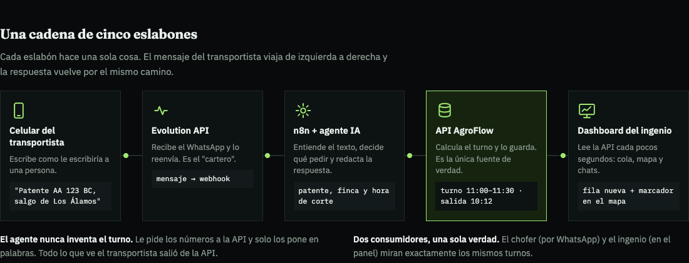
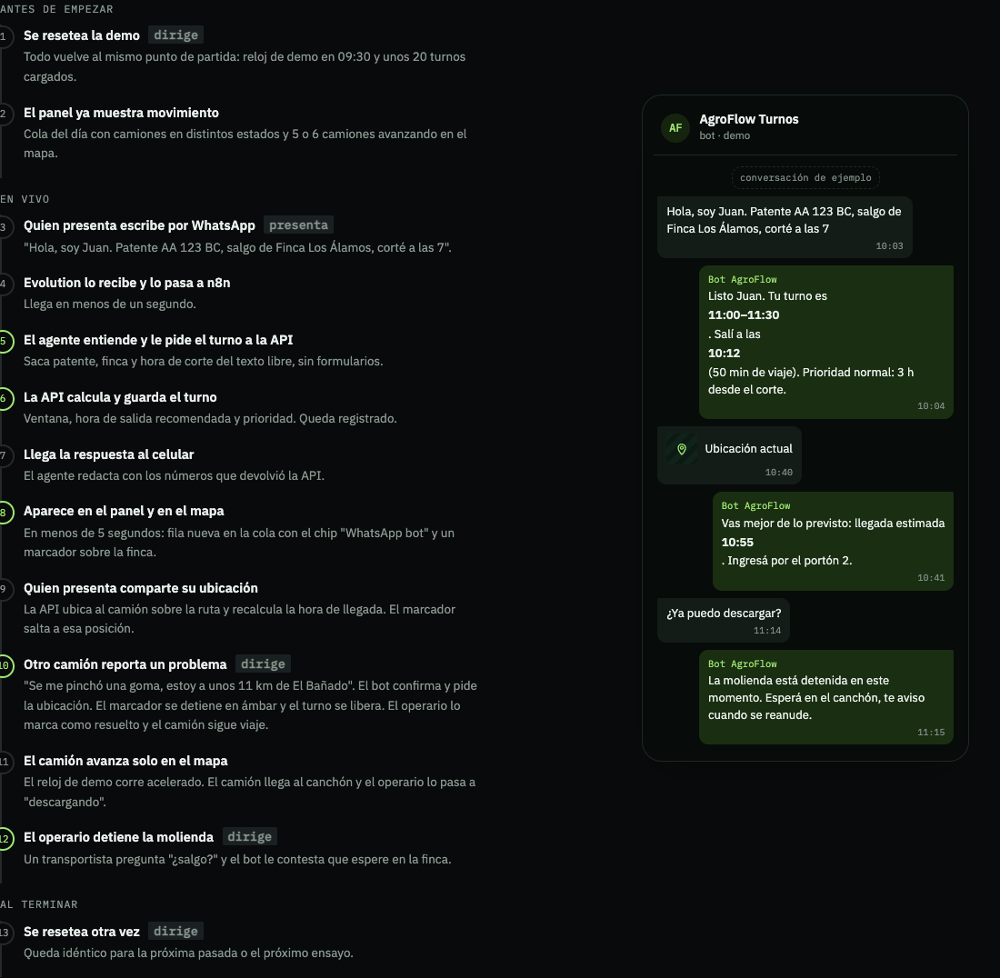
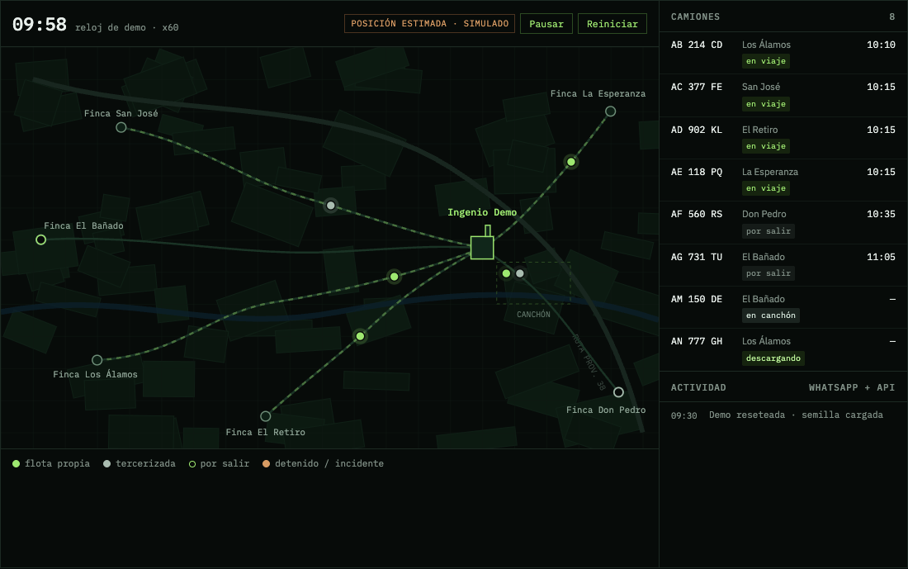
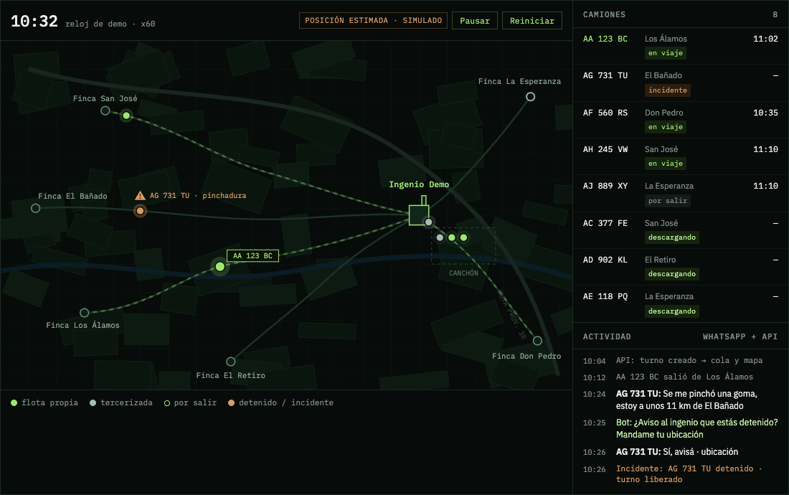
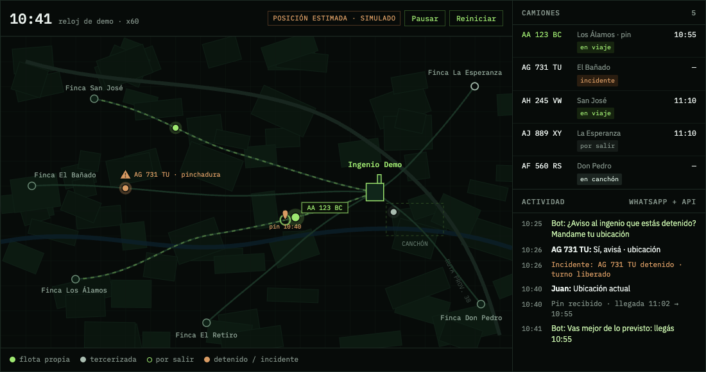
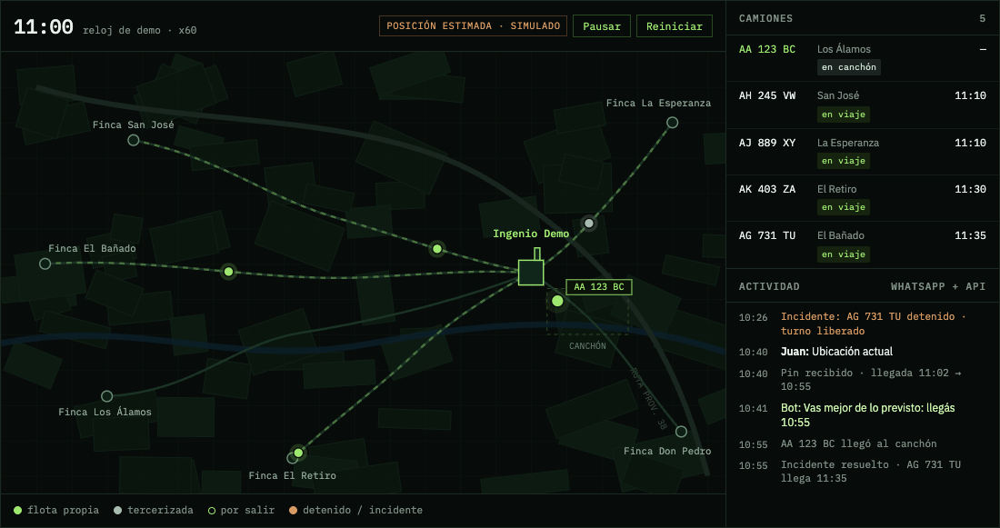
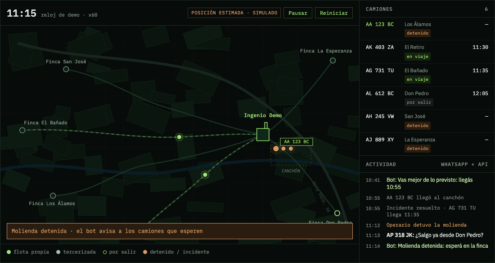
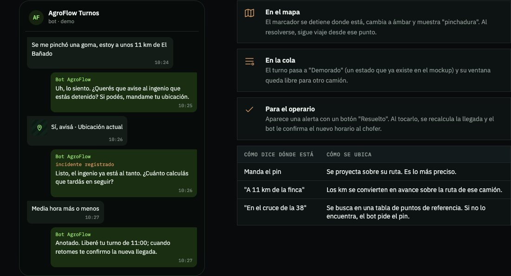

# AgroFlow demo plan — context for agents

Last updated: 2026-09-14. Demo date: **not fixed**, tentatively a couple of weeks out.

This is the working context for anyone (human or agent) picking up the AgroFlow
demo: what exists, what was decided, what the stack is, and what gets built
next. Read it before touching the API, the n8n workflow or the dashboard.

Related documents — this file does not repeat them:

| Document | What it owns |
|---|---|
| `CONTINUE-HERE.md` | Live infrastructure state on `vps-lab`, verified payload facts, safety constraints, rollback |
| `docs/API_CONTRACT.md` | Contract **v1** (3 endpoints). v2 below is a proposal not yet merged into it |
| `docs/DEMO_RUNBOOK.md` | Original deployment runbook |
| `docs/demo-plan/report/index.html` | Source of the team report (Spanish), including the simulated live map |
| Published report | https://claude.ai/artifact/2hhzYJEaHXuShqyYsJJH2h (private until shared) |

---

## 1. TL;DR

- A trucker asks for an unloading slot over WhatsApp; the sugar mill (ingenio)
  sees it appear in its dashboard queue and follows the truck on a map.
- **n8n owns the conversation. The API owns the record.** The dashboard reads
  the same rows the agent writes.
- It is a **demo**: calculations and truck positions are simulated,
  deterministic and labeled `simulated: true`. The WhatsApp channel, the AI
  agent and persistence are real.
- Scope approved on 2026-09-14: hybrid dashboard (API for turnos, status, chats,
  drivers, map; mocks for reports and config), deterministic simulator with a
  demo clock, **live map with estimated positions**, WhatsApp pin
  recalibration, **in-route incidents** (e.g. flat tire), driver profile memory.

---

## 2. Stack

| Layer | Technology | State |
|---|---|---|
| WhatsApp channel | Evolution API v2.3.7, Baileys integration, instance `agroflow-demo` | Running on `vps-lab`, connected |
| Conversation | n8n (Docker), AI Agent node with OpenAI | Workflow round trip verified with a stub; agent not built yet |
| n8n workflows | `flujos-n8n/Chatbot.json`, `flujos-n8n/stub-agroflow-api.json` | Exported, **not committed** |
| Dashboard | React 19.2, TypeScript ~6.0, Vite 8, oxlint. No router, no state library. Clean Architecture | Mockup only, in-memory mocks |
| Dashboard look | Tokens in `src/presentation/styles/tokens.css` (dark ground `#080a0b`, cane green `#9ee870`, amber `#d89b63`); Fraunces + IBM Plex Sans/Mono | Reused by the report |
| API | **Undecided.** .NET is the provisional direction; Node + TypeScript is the alternative. Contract-first, stack-agnostic | Not started |
| API storage | SQLite with a seed (proposal) | — |
| Map (dashboard) | Leaflet + OpenStreetMap tiles with attribution (proposal) | — |
| Infra | Docker Compose on `vps-lab`; `castel_proxy` nginx; Cloudflare Origin CA wildcard cert | Public DNS for n8n still missing |

API stack decision criterion: with a short timeline, pick what the person
building it knows best. The contract does not depend on the language.
No .NET SDK is installed on the development Mac.

---

## 3. Architecture

```
Trucker phone ──► Evolution API (Baileys) ──► n8n webhook ──► AI Agent ──► AgroFlow API ◄── Dashboard
      ▲                                                        │   tools          (truth)       (polls 3–5 s)
      └──────────────────── reply via Evolution sendText ──────┘
```



| Concern | Lives in | Why |
|---|---|---|
| Understanding free text, locations | n8n agent | What a language model is good at |
| Conducting the dialogue, wording | n8n agent | Prompt iteration beats redeploying |
| Short-term chat memory | n8n (Simple Memory) | Losing a thread on restart is acceptable |
| Turnos, calculations, positions, incidents, driver profile, message log | API | The dashboard must see it; two consumers cannot share state inside n8n |

Hard rules:

1. Anything the dashboard must see is written to the API **when it happens**.
2. The agent never invents a window, priority, departure or ETA. It calls the
   API and puts the returned numbers into words.
3. The agent confirms with the trucker before registering an incident.
4. Memory helps conversation; it is never a data source. Even a remembered
   plate is confirmed.

### What Baileys is

An open-source library that impersonates WhatsApp Web as a linked device.
Evolution API wraps it in REST. Free and instant (QR scan), but unofficial:
the number can be banned and it can break when WhatsApp changes. Demo only.
Production needs WhatsApp Cloud API (Meta, paid per conversation, business
verification). Therefore: disposable number, no bulk sends, simulated truckers
never go through Evolution.

---

## 4. The demo, step by step

Roles: **presenter** (writes from a phone) and **director** (a teammate on a
second laptop driving `/demo/*`).



1. Director resets the demo: demo clock 09:30, ~20 seeded turnos.
2. Dashboard already shows movement: queue in mixed states, 5–6 trucks on the map.
3. Presenter writes: "Hola, soy Juan. Patente AA 123 BC, salgo de Finca Los Álamos, corté a las 7".
4. Evolution → n8n webhook.
5. Agent extracts plate, origin, cut time; calls `POST /appointments`.
6. API computes window, recommended departure, priority; persists.
7. Agent replies with the API's numbers.
8. Within 5 s: new queue row (chip "WhatsApp bot") and a marker at the finca.
9. Presenter shares a location pin; API projects it onto the route and recalculates ETA.
10. Truck advances on the map (accelerated clock), reaches the yard, operator sets "descargando".
11. Another truck reports a flat tire; bot confirms, asks for location; marker freezes amber; window released; operator marks "Resuelto"; truck resumes.
12. Operator stops the mill; a trucker asks "¿salgo?"; bot tells them to wait.
13. Director resets for the next run.

---

## 5. Decisions log

| Date | Decision | Notes |
|---|---|---|
| 2026-09-05 | Agent lives in n8n; API owns the record | `docs/API_CONTRACT.md` §1 |
| 2026-09-05 | API stack undecided, .NET provisional | Team decision |
| 2026-09-14 | Demo date not fixed (~2 weeks, tentative) | Removed fixed dates from docs |
| 2026-09-14 | Hybrid dashboard via `VITE_DATA_SOURCE=mock\|http` | Mock stays as on-stage fallback |
| 2026-09-14 | Deterministic simulation: state is a pure function of the demo clock + seed + timed events | No `Math.random()` anywhere |
| 2026-09-14 | Live map with **estimated** positions, labeled "posición estimada · simulado" | Stages 1–3 in scope (see §8) |
| 2026-09-14 | WhatsApp pin (one-shot) recalibrates position; **no WhatsApp live location** | Baileys does not reliably deliver live-location updates to linked devices (Baileys issue #1026) |
| 2026-09-14 | In-route incidents in scope | Confirmation before registering |
| 2026-09-14 | Two memories + a log: n8n Simple Memory (session = `chatId`), driver profile in API, message log in API | |
| 2026-09-14 | Message log and pin handling are **fixed workflow calls**, not agent tools | The model could forget to call a tool |
| 2026-09-14 | Truckers simulator posts Evolution-shaped payloads straight to the n8n webhook | Header `X-AgroFlow-Simulated: true`, impossible phones like `5490000000001` |

---

## 6. Dashboard mockup audit (2026-09-14)

Run locally with Vite and driven with headless Chromium (Playwright): all six
views at 1440 px and 390 px, manual turno creation, reassignment, mill toggle,
page reload.

What works: all six views render with no page exceptions (the only console error
was a 404 for a static resource); the visual identity is
strong; Clean Architecture is real; `src/composition/container.ts` is the single
seam and instantiates the five repositories independently, so they can be
swapped one at a time.

| Impact | Finding | Evidence |
|---|---|---|
| Blocks demo | "Marcar" in *Camiones en canchón* calls `cancelar()` and deletes the truck | `PanelGeneralView.tsx:99`; verified yard count 3 → 2 |
| Blocks demo | `AvanzarEstadoTurno` is wired in the container but no view calls it | `TurnoUseCases.ts:54` |
| Blocks demo | Random data on every reload; timeline re-randomized on every 15 s poll; reports random | `MockTurnoRepository.ts:52`, `MockReporteRepository.ts:12` |
| Blocks demo | State is in browser memory; a created turno (AE123BC) vanished on reload | Verified |
| Confusing | Times relative to "now": turnos until 05:27, outside 06:00–22:00 | Screenshot `dashboard-02` |
| Confusing | Contradicting figures: bot share 50 % / 80 % (panel, per load) vs 92 % (reports); "42 turnos by bot" vs 30 total | Screenshots `dashboard-01/03/05` |
| Confusing | Header says "Conectado a WhatsApp Business API" (it is Baileys) | `dashboard-03` |
| Minor | "Reasignar" uses `window.prompt` without validation | `ColaTurnosView.tsx:68` |
| Minor | Sidebar items are `div` with `onClick` (no keyboard); layout overflows at 390 px | `Sidebar.tsx:24`, `dashboard-07` |
| Minor | Priority recomputed client-side; would diverge if the 18 h threshold changes | `ColaTurnosView.tsx:186` |

Repository → demo data source:

| Repository | Demo source |
|---|---|
| `TurnoRepository` | API |
| `ConversacionRepository` | API (templates and flow explainer stay mock) |
| `TransportistaRepository` | API (`/drivers`) |
| `ReporteRepository` | Mock, fixed and consistent |
| `ConfiguracionRepository` | Mock, fixed |

---

## 7. API contract v2 (proposal)

Base `/api/v1`, JSON, `X-Api-Key`, RFC 3339 UTC, every response carries
`simulated: true`. Freeze this into `docs/API_CONTRACT.md` before parallel work.

**Agent tools (n8n AI Agent, 5)**

| Method | Path | Purpose |
|---|---|---|
| POST | `/appointments` | Create turno; returns window, recommended departure, priority, priorityReason |
| GET | `/appointments?phone=` | "¿Cuál era mi turno?" |
| GET | `/status` | Current delay, mill state, snapshot metrics |
| GET | `/drivers/{phone}` | Driver profile so a returning trucker only confirms |
| POST | `/appointments/{id}/incidents` | Only after trucker confirms. Type, location (pin / km / landmark), estimated delay. Freezes position, releases window |

**Fixed workflow calls (not tools)**

| Method | Path | Purpose |
|---|---|---|
| POST | `/conversations/messages` | Log every inbound and outbound message |
| POST | `/drivers/{phone}/location` | Apply a pin to the active turno; returns new ETA for the agent to relay |

**Dashboard**

| Method | Path | Purpose |
|---|---|---|
| GET | `/appointments?date=` | Day queue (same objects the agent sees) |
| POST | `/appointments` | Manual creation, `channel: "manual"` |
| PATCH | `/appointments/{id}` | Reassign window |
| POST | `/appointments/{id}/advance` | Next lifecycle state |
| POST | `/appointments/{id}/cancel` | Soft cancel → `cancelled` |
| POST | `/incidents/{id}/resolve` | Operator resolves; truck resumes, ETA recalculated |
| PUT | `/mill` | Operating / stopped |
| GET | `/conversations` | Logged chats + bot metrics |
| GET | `/drivers` | Transportistas view |
| GET | `/trucks/positions` | Estimated position per truck for the map |

`GET /status` is extended with `avgWaitMinutes`, `botSharePct`,
`millCapacityTnH`, `zafraDay`, `timeline[]`, all derived from turnos.

**Demo control (director only)**

| Method | Path | Purpose |
|---|---|---|
| POST | `/demo/reset` | Reload seed |
| PUT | `/demo/clock` | Pause, resume, speed x1–x60 |
| POST | `/demo/scenarios/{name}` | "hora pico", "camión con pinchadura", "molienda detenida" |

**Appointment additions over v1**

```
driverName
fleet           own | contractor
channel         whatsapp | manual
status          pending | en_route | in_yard | unloading | completed | delayed | cancelled
hoursSinceCut   computed by API
waitMinutes     computed by API
eta             estimated; changes with pin or incident
positionSource  estimated | pin
incident        { type, lat, lng, locationSource: pin | km | landmark,
                  reportedAt, estimatedDelayMin, resolvedAt }
                while open: status = delayed
```

**Dashboard domain mapping** (lives in `src/infrastructure/http/`):

```
pendiente → pending      viaje → en_route      cancha → in_yard
descargando → unloading  completado → completed  demorado → delayed
propia → own             tercero → contractor
```

---

## 8. Simulation spec

Rule: **state = f(demo clock, seed, timed events)**. Same inputs, same output.

**Demo clock.** Starts 09:30, zafra day 42. Pausable, speed x1–x60, resettable.
Independent of wall-clock time.

**Seed.** Ingenio + 6 fictitious fincas (same names the dashboard shows) with
plausible coordinates 10–60 km away in the cane belt, route polylines, travel
minutes, ~20 turnos in mixed states, fictitious drivers and Mercosur-format
plates, a landmarks table (crossings, bridges, fuel stations). No real
establishments, plates or people.

**Lifecycle.**

```
pending   → en_route   at recommended departure
en_route  → in_yard    departure + travel minutes
in_yard   → unloading  when the window has capacity
unloading → completed  + unloading time
mill stopped: in_yard does not advance
```

**Estimated position.**

```
progress = (clock − departure) / travelMinutes      // clamp 0..1
position = point along route polyline at progress
```

Route polylines are computed **once** with an OpenStreetMap routing service and
stored in the seed. Nothing external is called live. Fallback: straight line.

| Map stage | What it shows | In scope |
|---|---|---|
| 1. Straight line | Markers from finca to ingenio | Yes |
| 2. Real route | Markers follow roads | Yes, first to cut |
| 3. Pin recalibration | Marker jumps to the pinned point, ETA recalculated | Yes |
| 4. Real GPS | Telemetry | Post-demo |

**Pin recalibration.** Project pin onto route → new progress.
`eta = pinTime + (1 − progress) × travelMinutes`. If the pin is more than 2 km
from the route, use a straight line pin → ingenio. `positionSource = pin`.

**Incidents.**

```
before      → normal progress
during      → frozen at pInc
after       → progress = pInc + (clock − resolvedAt) / travelMinutes
new ETA     = resolvedAt + (1 − pInc) × travelMinutes
```

Location: pin (projected), "N km from the finca" (`pInc = km / routeKm`), or
landmark name (lookup; if no match, the agent asks for a pin). Incidents are
timed events, so runs stay reproducible.

**Numeric assumptions (validate with someone who knows mill operations).**

```
mill capacity      340 t/h        (from mockup)
load per truck     ~28 t          assumption
average speed      ~45 km/h       assumption
unloading          ~15 min        assumption
window             30 min
window capacity    340 × 0.5 / 28 ≈ 6 trucks
route factor       1.3 × straight-line distance
priority           ≥18 h since cut = high, ≥8 h = medium (existing domain rule)
```

**Truckers simulator.** Reads a scenario JSON of timed events and POSTs payloads
shaped like Evolution's `MESSAGES_UPSERT` (`docs/samples/`) to the n8n webhook,
with header `X-AgroFlow-Simulated: true` and impossible phone numbers. n8n logs
the reply to the API and skips Evolution.

---

## 9. n8n target workflow

```
Webhook
  → Respond 200                    // acknowledge first so Evolution does not retry
  → Filter                         // messageType conversation | locationMessage · !fromMe · not @g.us
  → Normalize                      // + kind, lat, lng, simulated
  → POST /conversations/messages   // inbound
  → IF kind = location → POST /drivers/{phone}/location
  → AI Agent                       // Simple Memory (session key = chatId) + 5 tools
  → POST /conversations/messages   // outbound
  → IF !simulated → Evolution sendText
```

Verified facts and gotchas:

- Text is at `body.data.message.conversation` (captured live).
- Location pin: `body.data.message.locationMessage.degreesLatitude` /
  `degreesLongitude` per Evolution v2 docs. **Capture a real one before
  building the Normalize mapping.** The exact `messageType` value must also be
  confirmed from that capture.
- With a Webhook trigger (not the Chat trigger), Simple Memory needs the session
  key set manually ("Define below"), otherwise it fails with `No sessionId`.
- Simple Memory lives in n8n process memory and is lost on restart; acceptable.
  Upgrade path: Postgres Chat Memory. Do not reuse the Evolution Redis/Postgres.
- Use `messageTimestamp`, never `date_time` (3 h off).
- Incidents: prompt must require explicit confirmation before `reportIncident`.
  Test phrasings: "pinché", "se rompió", "estoy parado", "me quedé sin señal".
- Burst messages: demo writes one message at a time; production would debounce.
- Proactive notices (mill stopped) via Baileys only to team phones.

---

## 10. Dashboard work items

- `HttpTurnoRepository`, `HttpConversacionRepository`, `HttpTransportistaRepository` with English → Spanish mapping.
- `VITE_DATA_SOURCE=mock|http` in `container.ts`; reports and config always mock.
- New map view: Leaflet + OSM (attribution), dark green style, polls `/trucks/positions` every 3–5 s, animates markers between points, incident alert marker, "posición estimada · simulado" label.
- Poll queue and panel every 5 s.
- Fix "Marcar"; add "Avanzar"; replace `window.prompt`; add "Resuelto" for incidents.
- Show `simulated` badge on rows and map.
- Take priority from the API instead of recomputing it.
- Make mocks deterministic with the demo clock (fallback build).

---

## 11. Demo vs real system

| Piece | Demo | Real system |
|---|---|---|
| WhatsApp | Evolution + Baileys, disposable number | WhatsApp Cloud API |
| Understanding | n8n AI Agent (OpenAI) | Same, hardened |
| Truckers | 1–2 team phones + simulator | Real drivers |
| Slot calculation | Fixed predictable rules behind `IAppointmentScheduler` | Queue theory with real scale/mill capacity |
| Truck position | Estimated from clock + pin | GPS or driver app |
| Incidents | Reported by chat, pin/km/landmark | Same + telemetry, carrier notification |
| Fincas/routes | Fictitious seed | Mill cadastre/ERP |
| Mill state | Dashboard button | Plant systems |
| Storage | SQLite + seed | Postgres with backups |
| Access | One API key | Users, roles, audit |

---

## 12. Risks and fallbacks

| Risk | Fallback |
|---|---|
| WhatsApp bans the number | Disposable number, no bulk; simulated traffic bypasses Evolution; recorded video |
| Model answers unexpectedly live | Rehearsed script, prompt with examples, numbers only from API |
| Model registers a non-existent incident | Mandatory confirmation; operator can close it |
| API or VPS down | Dashboard build with `VITE_DATA_SOURCE=mock` + video |
| VPS memory (n8n already needs 896 MiB) | Measure API footprint, set a Compose memory limit |
| Estimated position read as real GPS | Visible "estimada · simulado" label |
| Personal data | Fictitious or disposable data only |

---

## 13. Work split and phases

| Track | Owns |
|---|---|
| API | Contract v2, endpoints, SQLite + seed, demo clock, lifecycle, positions, incidents, simulated scheduler |
| Dashboard | Http repositories, data source flag, map view, incident alerts, mockup fixes, deterministic mocks |
| n8n | AI Agent + memory + tools, location and log branches, incident confirmation, real pin capture, truckers simulator |
| Infra and rehearsal | API + dashboard on VPS, public routing (DNS pending), scenarios, backup video, rehearsals |

Phases (no dates): **1** freeze contract, seed and assumptions; stubs in n8n →
**2** build tracks in parallel against stubs → **3** integrate real URLs, deploy,
first full run → **4** rehearse with resets, record video, tune prompt.

Cut order if time runs short: landmarks table (ask for pin) → real routes
(straight line) → truckers simulator → chats view. Never cut: turno over
WhatsApp, row in queue, truck moving on the map.

---

## 14. Open decisions

1. API stack (.NET vs Node + TypeScript).
2. Demo clock start and on-stage speed (recommendation: 09:30, switch x10 ↔ x60 live).
3. Finca names and coordinates (recommendation: dashboard names, fictitious, plausible cane-belt coordinates).
4. Who validates load per truck, speed and unloading time.

---

## 15. Screenshots

All files live in `docs/demo-plan/screenshots/`. Captured 2026-09-14 with
headless Chromium (Playwright). Report captures use a faked browser clock, so the
map frames are reproducible; dashboard captures come from the mockup and show
**random data** that changes on every load.

### Simulated live map (from the report)

Frames of the same looping morning (1 real second = 1 demo minute). Map content
is fictitious. These illustrate the target dashboard map, not an existing screen.

| File | Demo clock | Shows |
|---|---|---|
| `map-01-0958-morning-seed.png` | 09:58 | Seeded state: trucks en route, pending at fincas, two in the yard; truck list and activity feed |
| `map-02-1032-incident-flat-tire.png` | 10:32 | AG 731 TU frozen amber with "pinchadura" alert; incident chat in feed; AA 123 BC en route |
| `map-03-1041-pin-recalibration.png` | 10:41 | AA 123 BC with "pin 10:40" marker and `pin` source; ETA 11:02 → 10:55 in feed |
| `map-04-1100-incident-resolved.png` | 11:00 | AG 731 TU resumed from the incident point, new ETA 11:35; AA 123 BC in the yard |
| `map-05-1115-mill-stopped.png` | 11:15 | Mill stopped banner; yard trucks "detenido"; bot telling a trucker to wait |
| `report-07-map-mobile-390.png` | 09:58 | Map at phone width: map scrolls horizontally (the ingenio is off-screen until scrolled), list stacks below |







Known cosmetic issues in the report map: the mill-stopped banner overlaps the
"Finca Don Pedro" label; at 390 px the SVG keeps a 560 px minimum width.

### Report sections

| File | Shows |
|---|---|
| `report-01-flow-chain.png` | Five-link flow: phone → Evolution → n8n agent → API ← dashboard |
| `report-02-demo-walkthrough.png` | Step-by-step demo with roles and the example WhatsApp chat |
| `report-03-incident-section.png` | Flat-tire chat, effects on map/queue/operator, location methods |
| `report-04-three-parts.png` | Chatbot / API / Dashboard cards: has / does not do |
| `report-05-memory-layers.png` | Chat memory, driver profile, message log |
| `report-06-header-light-theme.png` | Report header, table of contents and start of Part 1 in light theme |



### Dashboard mockup (current state, `AgroFlow-Dashboard`)

| File | View | Notes |
|---|---|---|
| `dashboard-01-panel-general.png` | Panel general, 1440 px full page | KPIs, virtual queue timeline, yard table with the buggy "Marcar", bot feed |
| `dashboard-02-cola-turnos.png` | Cola de turnos, full page | 30 turnos, times past midnight, filters, Reasignar/Cancelar |
| `dashboard-03-chatbot.png` | Chatbot WhatsApp, full page | Metrics, conversations, templates; "WhatsApp Business API" wording |
| `dashboard-04-transportistas.png` | Transportistas, full page | Driver list with active toggle |
| `dashboard-05-reportes.png` | Reportes, full page | KPIs, wait per day, fleet split, fincas table (random) |
| `dashboard-06-configuracion.png` | Configuración, full page | Ingenio data, business rules (18 h threshold), n8n integration, notifications, users |
| `dashboard-07-cola-mobile-390.png` | Cola de turnos at 390 px | Sidebar does not collapse; table overflows |
| `dashboard-08-nuevo-turno-form.png` | "Cargar turno manual" form | Fields: patente, transportista, finca, flota, hora, horas desde el corte |
| `dashboard-09-molienda-detenida.png` | Panel alert cards | Mill toggle switched to "Molienda detenida" |

### Regenerating

- Report: open `docs/demo-plan/report/index.html` directly (it loads Google Fonts;
  images under `report/img/`). The map is inline SVG + vanilla JS; the scenario
  data (`FINCAS`, `TRUCKS`, `EVENTS`) sits at the bottom of the file.
- Deterministic map frames: install Playwright's fake clock before loading the
  page (`page.clock.install`), then `page.clock.runFor(seconds * 1000)` to reach
  a demo time (start 09:58; +1 s = +1 demo minute) and screenshot `.screen`.
- Dashboard: `npm run dev` in `AgroFlow-Dashboard`; sidebar items are `.nav-item`
  divs, not buttons.

---

## 16. References

- Evolution API v2 — send location / `locationMessage`: https://doc.evolution-api.com/v2/api-reference/message-controller/send-location
- Baileys issue #1026 — live location update events: https://github.com/WhiskeySockets/Baileys/issues/1026
- n8n docs — Simple Memory session ID with non-chat triggers; Postgres/Redis Chat Memory nodes (`n8n-io/n8n-docs`)
